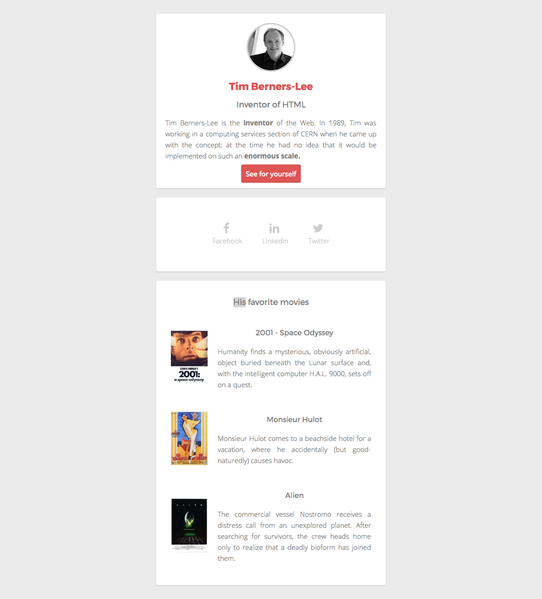

# Introduction

## Compétences

- Compréhension
- Autonomie
- Organisation
- Execution
- Présentation

## Objectifs

- Réaliser une page présentant Aaron Swartz
- Comprendre comment exécuter un layout à partir de HTML et de CSS
- Utiliser des outils tels que Google Webfont, FontAwesome
- muscler ton réflexe Git

## Briefing

### Étape 1 : Git

- Crée un dépôt sur GitHub nommé `aaron-swartz`
- Clone ce dépôt sur ton ordinateur pour démarrer le développement local.
- Rédige un readme.md qui explique le qui/quoi/quand/comment/pourquoi.

### Étape 2 : HTML

`cd ` dans le dossier **"aaron-swartz"**

- Crée un fichier **index.html**
- Crée un fichier **style.css**
- Crée un dossier **images**
- Télécharge ces images dans le dossier **images** :   
	- 
	- 
	- Tu peux en [ajouter d'autres si tu veux](https://www.ecosia.org/images?q=aaron+swartz).  
- Dans **index.html** rédige un contenu présentant Aaron soit en Français à partir de [la veille de Guillaume](https://docs.google.com/presentation/d/19_uMInv5zp1HRO4IWIV-QBfPaoP0d9oHofMRXuQ44QQ/edit), soit en Anglais à partir de [ce contenu](./contenus/8-contenu_aaron-swartz.md), le tout en en html5 **valide** (vérifier via le validateur W3C).
  - Lien vers la page Wikipedia de Tim Berners-Lee : https://fr.wikipedia.org/wiki/Tim_Berners-Lee
  - Pour intégrer les icônes utilise [FontAwesome](http://fontawesome.io/icons/)

### Étape 3 : CSS

**Fais en sorte que ta page ressemble à celle-ci**  


- Pour avoir une jolie typographie utilise une webfont gratuite sur [Google Font](https://fonts.google.com/?query=open&selection.family=Montserrat|Open+Sans). Par exemple :   

```html  
<link rel="stylesheet" href="http://fonts.googleapis.com/css?family=Open+Sans:400,300,700|Montserrat:400,700">
```

- Ajoute des `div` en HTML pour séparer les éléments en blocs
- Dans **style.css**
   - Redimentionne les `div`
   - Centre les `div`
   - Mets une couleur de fond sur les `div`
   - Change la couleur des textes
   - Aligne les textes

À chaque étape réussie, pense à committer localement.

### Étape 4 : Sauver avec Git

- Faire un `add` 
- Faire un `commit` 
- Faire un `push`
- Aller sur votre profile GitHub pour vérifier si les changements locaux se trouvent bien sur votre repo distant. Si c'est le cas, c'est cool. Sinon, c'est pas cool et cherche à comprendre pourquoi jusqu'à ce que cela fonctionne.

### Étape 5 : Présentation

- Publie ton projet comme une Github Pages
- Si tu veux, publie l'url sur notre team Ryver 

### Étape 6 : un gros câlin


