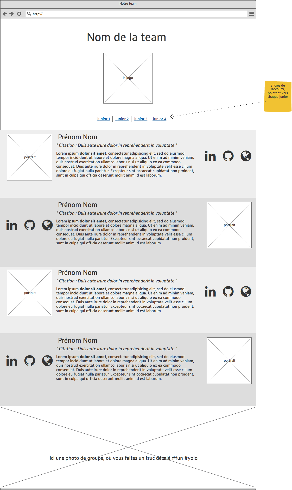
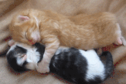

# Team About page

- en groupe de 4 ou 5 (max)
- repo : `exercice-9-team-presentation`
- stratégie : mousquetaires.
- temps imparti : aujourd'hui plus 2 jours ouvrables, top chrono.

## Objectif
Créer une page html qui présente chaque membre de ton équipe. Il n'y aura qu'une seule page html, chacun(e) va travailler sur sa branche puis la merger dans le master.

## Compétences travaillées

- Maitriser Git en groupe
- html + css
- framework css : knacss

## Briefing

### 1 : Git
- Désignez le/la **capitaine** de la branche "master". Cette personne donne le "feu vert" pour signaler à chaque membre quand il/elle peut merger.
- Elle crée le dépôt sur GitHub (voir nom fourni ci-dessus)
- Chacun(e) clone ce dépôt sur son ordinateur pour démarrer le développement local, et travaille sur sa propre branche.
- Le groupe rédige un readme.md qui explique le qui/quoi/quand/comment/pourquoi.
- Chacun(e) doit composer sa partie de la page, puis la merger dans le master.
- Discutez ensemble de la manière dont vous allez collaborer concrètement.
- Chacun(e) doit penser à committer localement et régulièrement tout au long de l'exercice.
- Lorsqu'un membre a terminé sa section, il la fait valider par le capitaine. Si celui-ci est ok et qu'il donne le feu vert, le membre merge alors sa branche dans le master. Attention : les autres doivent donc puller au fur et à mesure, afin d'avoir leur version locale à jour... Pensez aussi à systématiquement puller en tout début de session de travail, dès fois qu'un teamate aurait bossé pendant la nuit...

### 2 : Le contenu

- Branding: donnez un **nom à votre équipe**, et **fabriquez un logo rapidement** (via https://www.hipsterlogogenerator.com par exemple) 

Chaque membre contribue à la création du contenu à présenter, avec ces informations le concernant :   

- une photo de son visage  
- son prénom et nom en titre
- un slogan (ou une citation favorite) en sous titre
- un ou deux paragraphes décrivant ce qu'il/elle vient chercher à BeCode, et son objectif professionnel après BeCode.
- trois liens externes (linkedin, github, site perso) avec des icônes.

- une photo de groupe, format paysage, où vous vous montrez de manière dynamique et décalée.

### 3 : L'aspect visuel
- utilise le framework CSS [knacss](https://knacss.com/)
- personnalise la couleur des liens
- respecte le schéma d'écran ci-dessous, en alternant la position horizontale de la photo (à gauche si la précédente personne l'avait à droite, et inversément).
- Pour chaque zone, choisir une couleur de fond différente (si tu veux, va voir sur [coolors.co](https://coolors.co) pour avoir des agencements harmonieux).

### 4 : développement

`cd ` dans le dossier de travail

- Crée un fichier **index.html**
- commit
- Crée un fichier **assets/css/style.css**
- commit
- Crée un dossier **assets/images**
- commit
- intègre knacss à ta page html
- ...

### 5 : Présentation

- Publie ton projet comme une Github Pages
- Publie l'url sur notre team Ryver. S'il est vraiment chouette, on le partagera sur le channel global.

### 6 : un gros câlin

