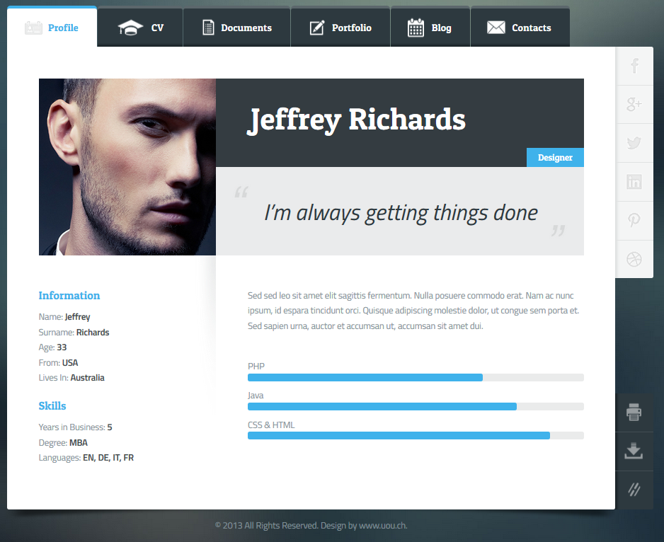
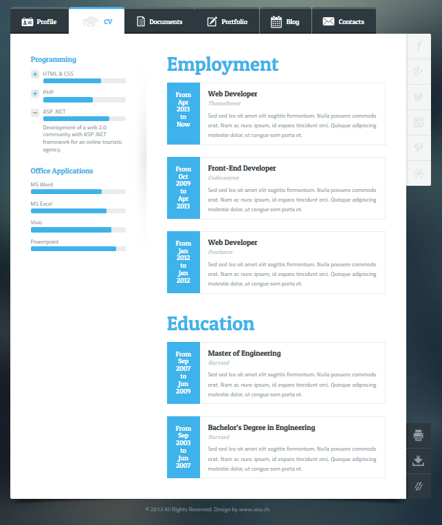
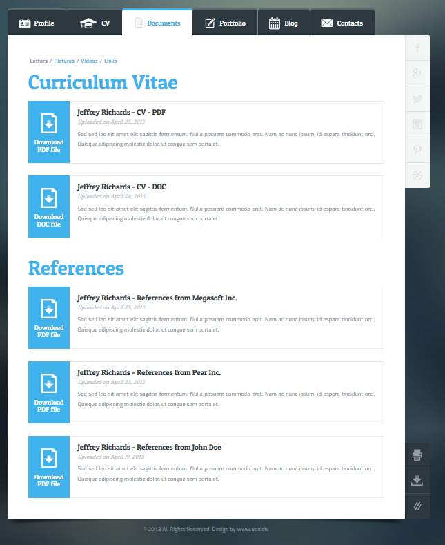
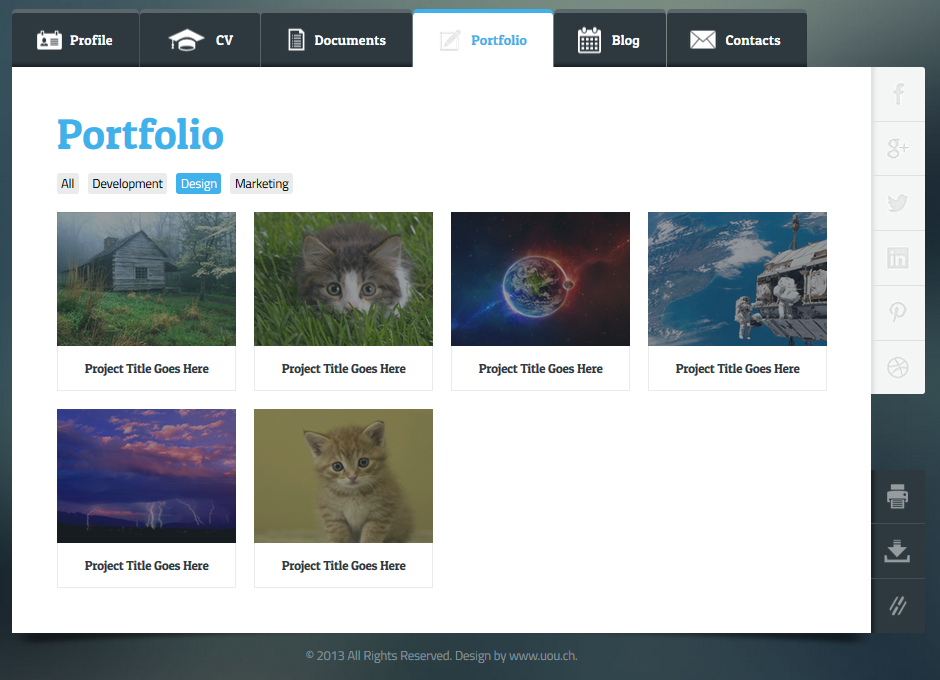
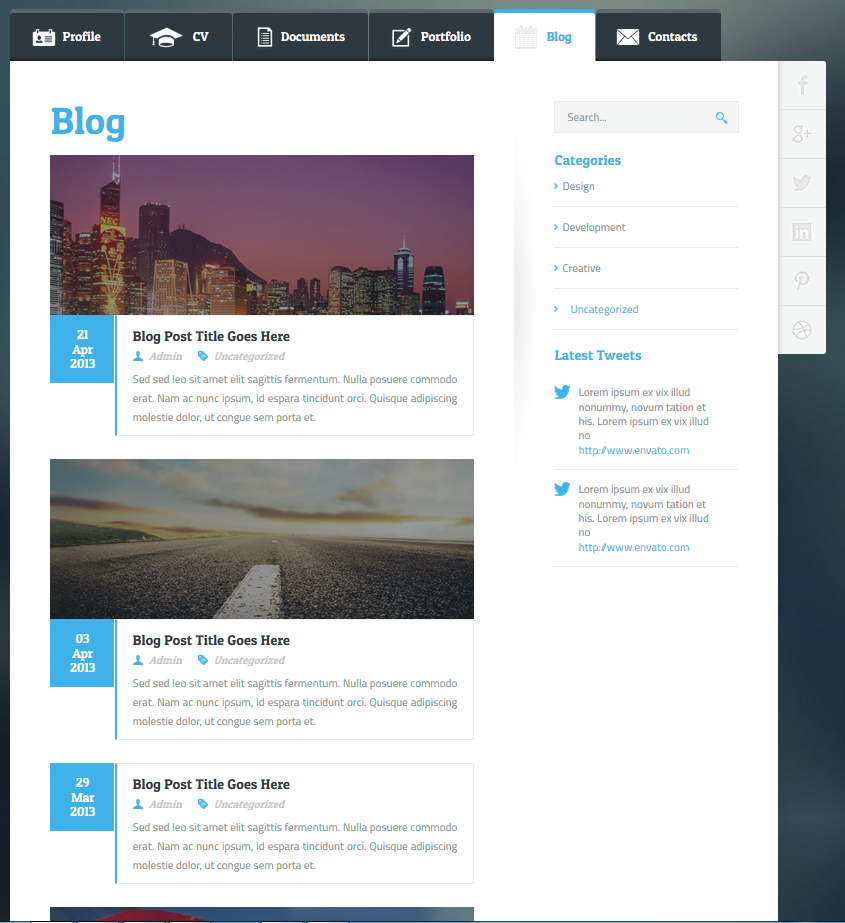
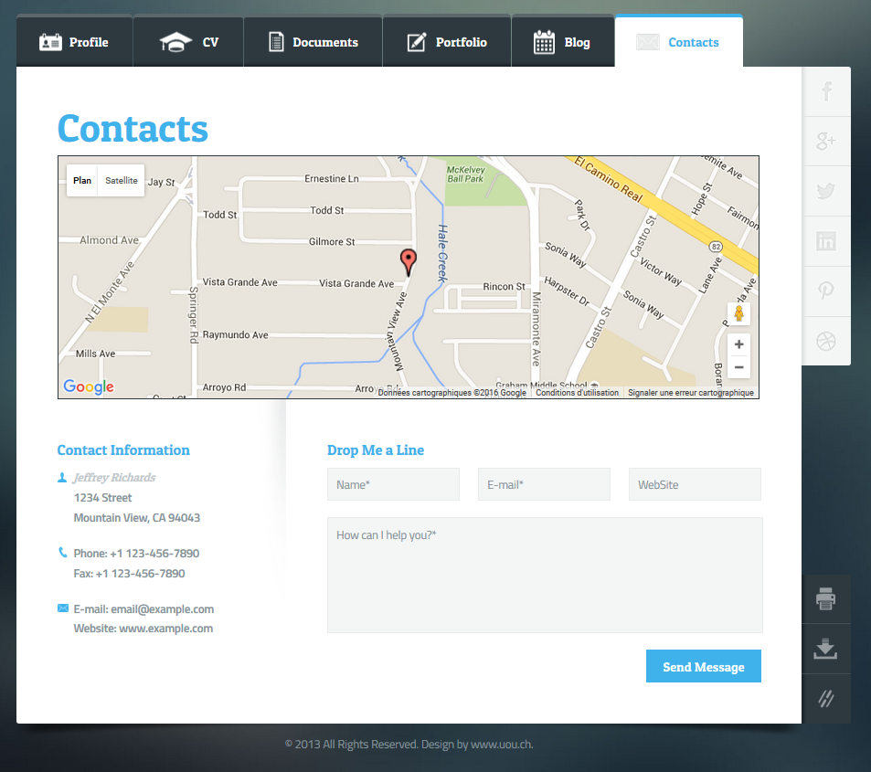

# Projet : site WordPress pour le C.V.

## Objectif

Le but est la création d'un site WordPress de présentation de votre Curriculum Vitae à partir du
design [FlexiCV.zip](flexicv.zip) téléchargé sur Internet (fichier index.html + fichiers CSS,JS et images).
Vous devez le personnaliser en remplaçant les données fournies en exemple par vos données
personnelles.

## Indications

Utilisez la même démarche que celle décrite dans les tutoriels suivants :
- Tutoriel 1 : [Créez votre thème WordPress de A à Z](http://www.fran6art.com/wordpress/creez-votre-theme-wordpress-de-a-a-z/)
- Tutoriel 2 : [Le Guide WordPress : Le Tutoriel – Créer un site de A à Z](http://wordpress.bbxdesign.com/)
- Toutes les fonctions utilisées sont décrites dans le [Codex WordPress](https://codex.wordpress.org/fr:Accueil).
- N'hésitez pas à consulter également [Les Marqueurs de Modèle](https://codex.wordpress.org/fr:Decouvrir_les_Marqueurs_de_Modele).

La version du [Codex en anglais](https://codex.wordpress.org/Theme_Development) est plus récente et plus détaillée. Également, il y a les pages relatives au [Code Reference](https://developer.wordpress.org/reference/
) qui sont intéressantes.

## Consignes

Télécharger le modèle [FlexiCV.zip](flexicv.zip).

A partir du fichier index.html, délimitez les différentes zones dans la page pour créer l'entête
(header.php), le pied de page (footer.php), la barre latérale (sidebar.php), les zones de contenu
(index.php),...

Dans l'onglet « Profile » :
- Changez la photo, le nom (Jeffrey Richards), la profession (Designer), la citation (« I’m
always getting things done ») et remplacez-les par vos données personnelles.
- Idem avec les nom, prénom, âge, compétences (skills) et les barres de progressionDans l'onglet « CV »
- Remplacez les informations par vos données personnelles : les compétences techniques
détaillées, les précédents emplois et les études
Dans l'onglet « Documents »
- Placez votre CV en PDF (et éventuellement d'autres documents) à télécharger
- Possibilité de mettre aussi des images, des vidéos et des liens

Dans l'onglet « Portfolio » :
- Vous pouvez placer des images pour montrer vos travaux personnels

Dans l'onglet « Blog » :
- Vous pouvez afficher des articles classés par catégorie, des widgets,...

Dans l'onglet « Contacts » :
- Si vous modifiez l'adresse, le plan s'adapte automatiquement. Vous pouvez mettre vos données
personnelles.

## Ressources :

- [Propulsez votre site avec WordPress](https://openclassrooms.com/courses/propulsez-votre-site-avec-wordpress/premiers-pas-dans-le-code)

## Aperçus :

