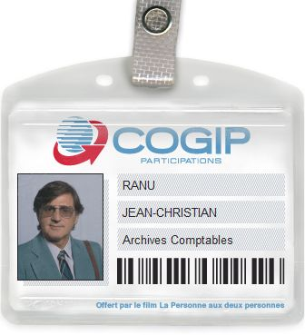

# Facturation
## An app for Jean-Christian Ranu

Jean-Christian Ranu est comptable à la COGIP. Il utilise depuis des années une application qui est moche, qui n'est pas complète et donc, il doit jonglée entre son logiciel de compta et des fichiers excel.

Nous vous proposons de coder une web application (limitée à l'usage desktop mais si l'envie vous prend de la rendre responsive, c'est encore mieux) qui répondre aux besoins et envies de Jean-Christian.

## Les données dont Jean-Christian a besoin

Pour les personnes, il nous faudra :
- le nom
- le prénom
- le téléphone
- l'adresse e-mail

Pour les sociétés
- désignation sociale de la société
- l'adresse de la société
- le pays
- le n° de TVA
- le n° de téléphone

Pour les factures
- le numéro de la facture
- la date de la facture
- le n° du bon de commande ou devis associé
- montant

Pour les notes de crédit
- le numéro de la note de crédit
- la date de la note de crédit
- montant

Pour le type (de société)
- le type

Bien sûr, ces tables seront liées entre elles et selon que vous souhaitiez développer une application basique pour pratiquer du code ou une application qui pourrait être réellement utile, vous pouvez rajouter des informations en fonction de votre ambition (par exemple, gérer du personnel et les notes de frais... Ou encore prendre en compte le fait qu'un facture soit ouverte donc non payée ou qu'elle ait été réglée...).

**Notes**

- bon de commande : Une facture, pour qu'elle soit approuvée par Ranu, doit correspondre à un bon de commande.
- note de crédit : document qui sert à annuler en partie ou en totalité une facture. Elle est donc  souvent associée à une ou plusieurs factures.
- Type : savoir si la société est un fournisseur ou un client
- Concernant les relations entre les tables, il faudra :
  - societes---type
  - societes---factures
  - factures---notes de crédit
  - personnes---factures
  - personnes---societes

## L'app pour Ranu

### page d'accueil
Affichera :
- un message d'accueil pour Jean-Christian Ranu
- la liste des 5 dernières factures, classées par date
- la liste des 5 dernières notes de crédit, classées par date
- la liste des 5 dernières personnes, encodées dans la base de données
- la liste des 5 dernières entreprises, encodées dans la base de données
- un lien vers la page fournisseurs
- un lien vers la page clients

### page sociétés
Affichera la liste des sociétés par ordre alphabétique.

Le nom de chaque société sera un lien qui renverra vers une nouvelle page detailsociete dont le contenu sera généré en fonction de l'id de la société choisie.

BONUS : On appliquera un filtre par types pour mieux trier les sociétés

### pages factures et notes de crédit
Affichera la liste des numéros de toutes les factures / notes de crédit par date la plus récente vers la date la plus lointaine.

Chaque numéro de facture sera un lien qui, au clic, renverra vers une page detailfacture dont le contenu sera généré en fonction de l'id de la facture sélectionnée.

BONUS : On appliquera un filtre par société pour mieux trier les factures

### page annuaire
Affichera la liste de toutes les personnes de contact de la base de données, par ordre alphabétique.

Le nom de chaque personne sera un lien qui renverra vers une nouvelle page detailcontact dont le contenu sera généré en fonction de l'id de la personne choisie.

BONUS : On appliquera un filtre par société pour mieux trier les personnes de contact

### page fournisseurs
Affichera la liste de toutes les sociétés de type fournisseur. Chaque nom de société renvoie, à l'aide d'un lien, vers sa page detailsociete dédiée.

### page clients
Affichera la liste de toutes les sociétés de type client. Chaque nom de société renvoie, à l'aide d'un lien, vers sa page detailsociete dédiée.

### detailsociete
Affichera les informations suivantes selon la société choisie :
- nom de la société
- adresse de la société
- téléphone de la société
- numéro de TVA de la société
- compte bancaire de la société
- liste des factures liées à la société
- liste des personnes de contact travaillant dans la société

## detailfacture
Affichera les informations suivantes selon la facture choisie :
- numéro
- date
- bon de commande
- société liée à la facture
- type de la société liée à la facture (fournisseur ou client)
- numéro de compte bancaire de la société liée à la facture
- personne de contact liée à la facture

### detailcontact
Affichera les informations suivantes selon la personne de contact choisie :
- nom, prénom
- téléphone
- e-mail
- nom de la société où travaille la personne
- adresse de la société
- la liste des factures liées à la personne

### BONUS
Réaliser un petit design sympa pour notre ami Jean-Christian. Rappelez-vous que notre ami et client est comptable à la COGIP depuis plus de 20 ans ! Il est temps de dépoussiéré ses habitudes et de l'aider à rentrer dans l'ère du 21ème siècle !

