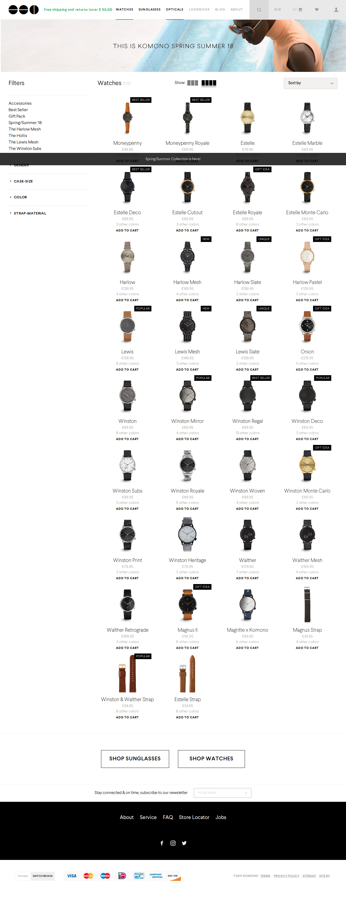

# Projet avec framework PHP

Par défaut, un webshop pour vendre des montres. Si vous avez une autre idée (vendre autre chose), faites-vous plaisir !

## Contraintes

- Utiliser un framework PHP de votre choix (Laravel, Symfony, Fat-free, CakePHP,...)
- Réaliser un site qui fasse vrai. Donnez-vous à fond.
- Équipe ou solo ? Comme vous voulez mais indiquez-le dans le readme.
- Un design épuré (le moins, le mieux)
- Temps imparti : 2 semaines.
- Faites de votre mieux. L'objectif est pédagogique mais aussi de montrer aux recruteurs et/ou futurs clients ce que vous avez dans le ventre ;)

## Pages

- Accueil
- Catégories (sport, casual, luxe,...)
- Public visé (femme, homme, fille, garçon)
- Détails des montres (choix des couleurs)
- Informations légales / Conditions générales de vente

- Enregistrement du client
- Connexion du client
- Panier
- Commandes passées
- Commendes en cours
- Page de contact

- Administration
- Gestion des produits (en stock, vendus, sold out)
- Gestion des clients (commandes passées, en cours, infos clients)

## Fonctionnalités

- système de filtre par catégorie, public, couleurs, taille (si d'application)
- prévoyez un compte visiteur avec des accès restreints pour qu'on puisse visiter l'interface client et l'interface admin sans rien y faire (oui, en plus de l'accès admin pour qu'on puisse tester si ça marche)

## Inspirations

- les sites de ventes de montre
- l'image en dessous qui provient de [komono](https://shop.komono.com/collections/watches)
